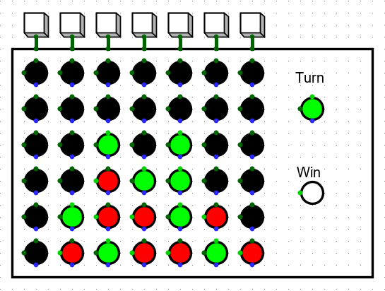
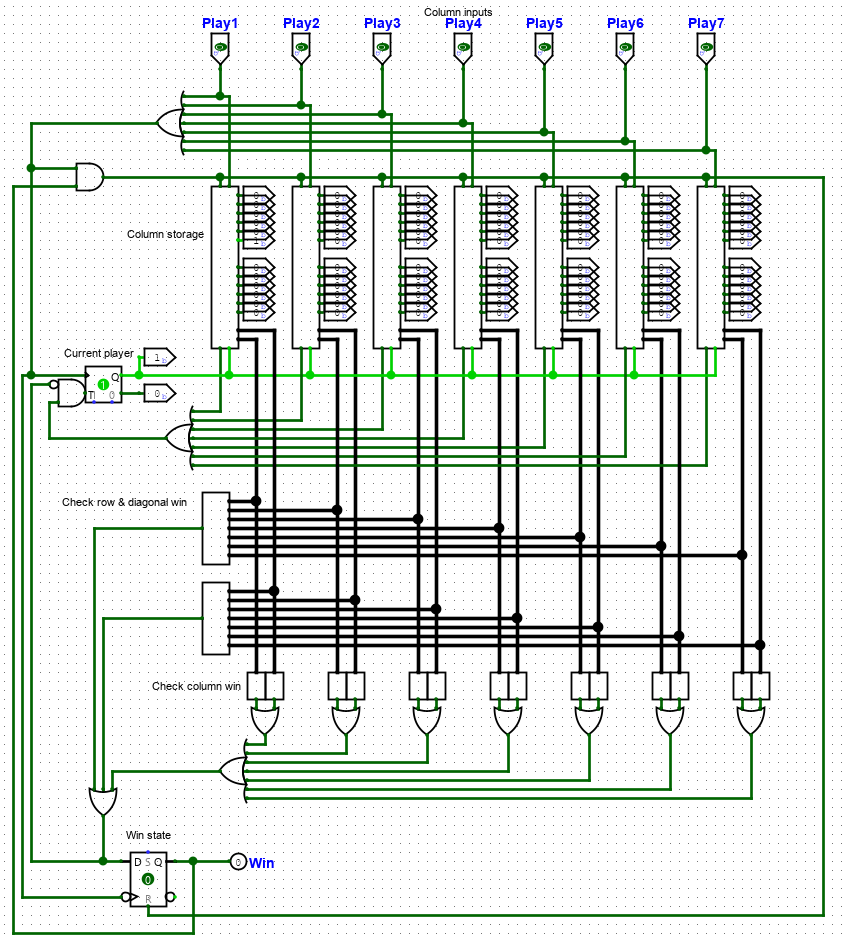
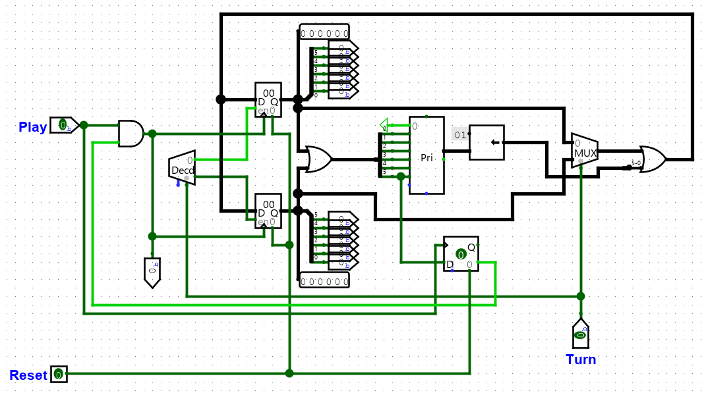

# logisim-connectfour
Connect Four implemented as a Logisim circuit.

No score counting; board resets after win.

No clock needed.

[Click for demo video](https://www.youtube.com/watch?v=ynTgykqO_iA)

